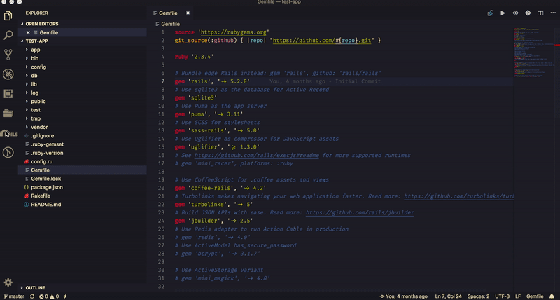
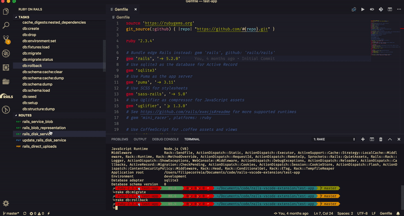

# Rails Extension

A simple extension focused on helping development of ruby on rails apps.

## Features

Listing and running rake tasks

Listing the routes

# Release Notes

### 0.0.1

- **feat** Lists and runs rake tasks

- **feat** Lists routes

# Contributing

1. Fork it <https://github.com/runtimerevolution/rails-vscode-extension/fork>
2. Create your feature branch `git checkout -b my-new-feature`
3. Commit your changes `git commit -am 'Add some feature'`
4. Push to the branch `git push origin my-new-feature`
5. Create a new Pull Request

# Contributors

- [@laginha87](https://github.com/laginha87) Filipe Correia - mantainer

 Icon made by bqlqn from www.flaticon.com